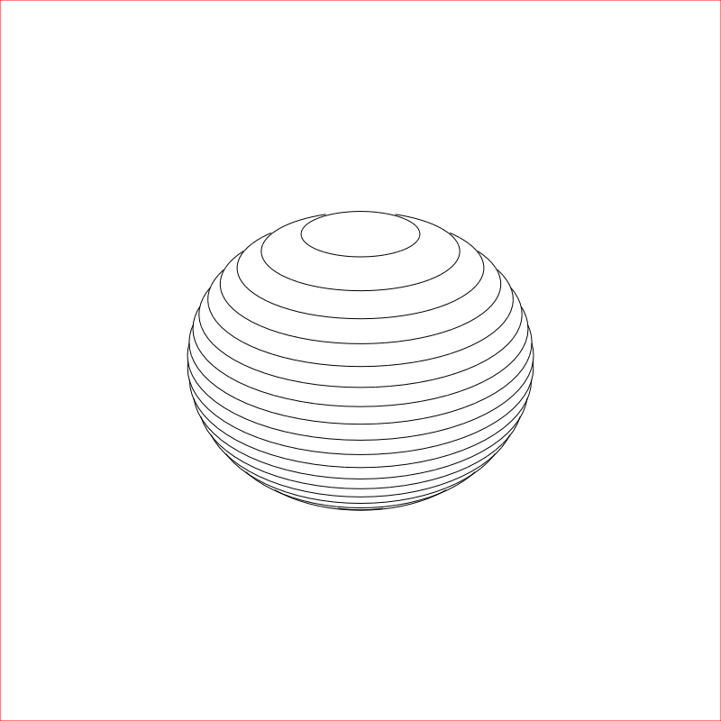

# gnarled
A playground for experimenting with SVG generation, with a view to being used with
an Axidraw pen plotter for producing interesting art.

## Example SVGs

Test for support of 3D primitives.

Modified Seirpinski triangle

Basic shading applied to a circle.

